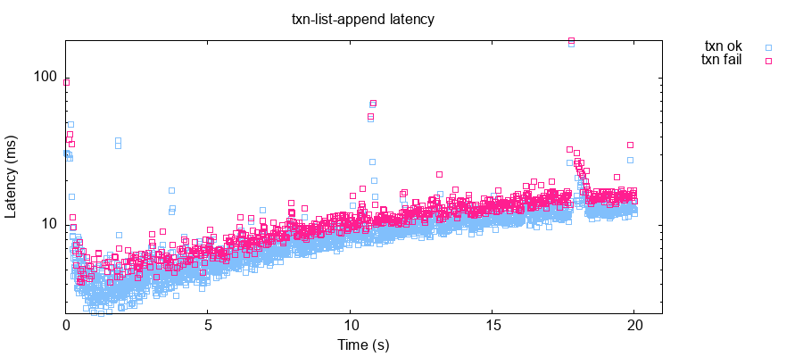
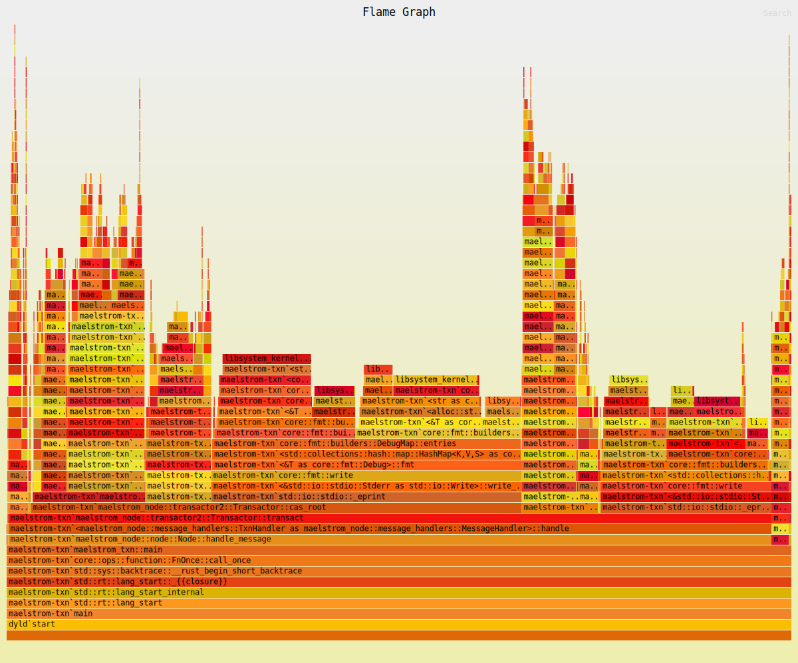
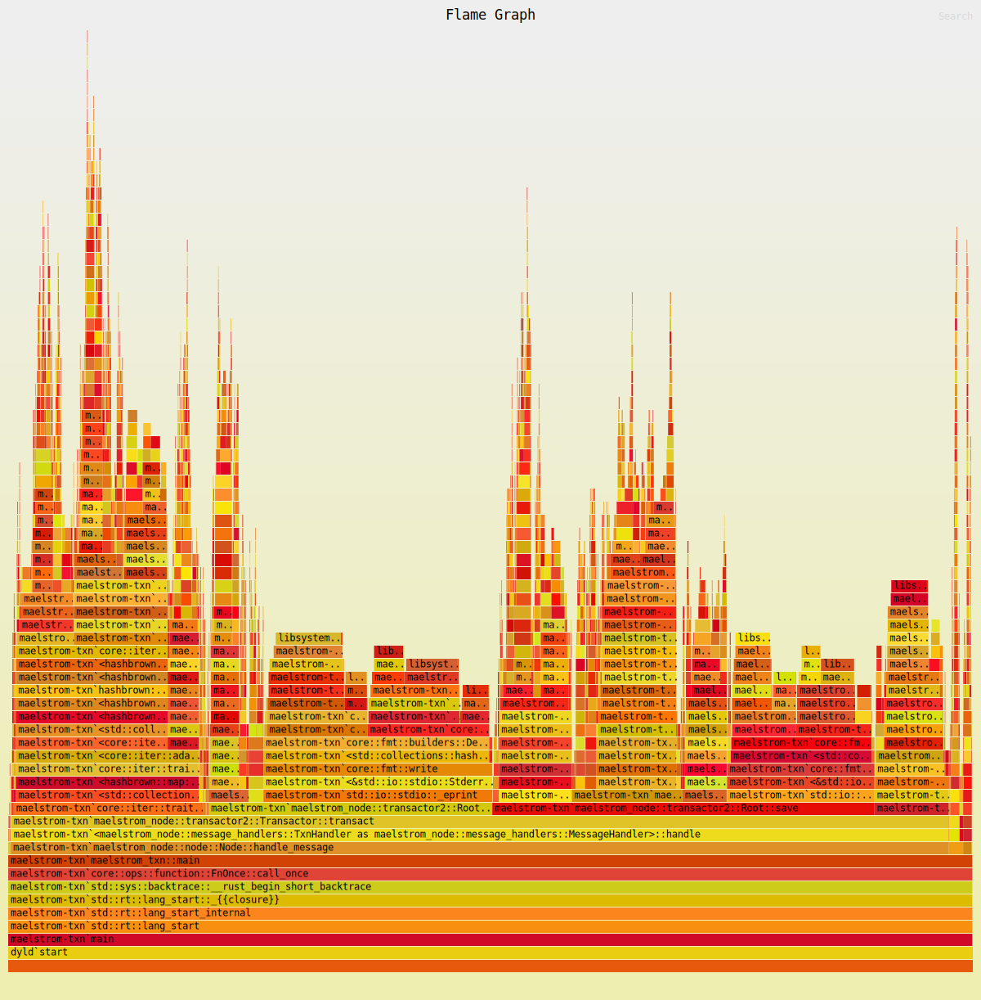
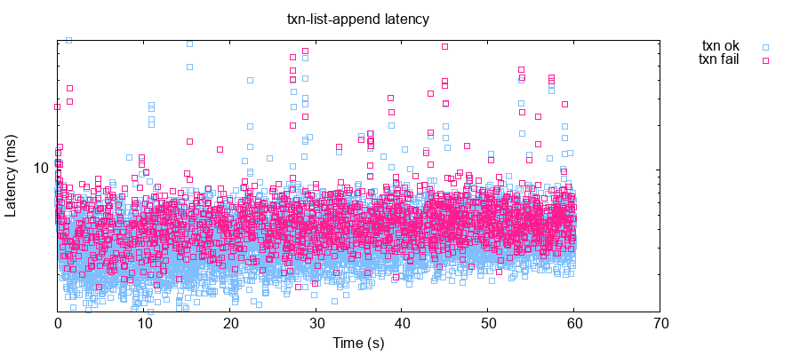

# maelstrom-node

see `git log` for development history.

Before testing, install the [prerequisites](https://github.com/jepsen-io/maelstrom/blob/main/doc/01-getting-ready/index.md#prerequisitess).

# debugging tips

## serve

```bash
./test.sh serve
```

Then open the URL http://localhost:8080 in your browser and you should see the
messages from the protocol in the messages.svg.

## log

Use `eprintln!`. The output will be logged to, such as `store/broadcast/latest/node-logs/n0.log`.


# specification

## Challenge #3b: Multi-Node Broadcast

In this challenge, we simply broadcast a message we have never seen to all other
nodes.

reference:
  * https://github.com/jepsen-io/maelstrom/blob/main/doc/03-broadcast/01-broadcast.md


## Challenge #3c: Fault Tolerant Broadcast

In this challenge, we need to handle message loss.

reference:
  * https://github.com/jepsen-io/maelstrom/blob/main/doc/03-broadcast/02-performance.md

### optimization

First goal: reduce the number of messages sent between nodes(internal servers).
Solution: don't broadcast a message back to the server which sent it to us.

### dealing with failure

when messages are lost, we need to retry sending the message and we need a way to know when to stop retrying.

## Challenge #7a: Datomic Transactor Model

reference:
  * https://github.com/jepsen-io/maelstrom/blob/main/doc/05-datomic/01-single-node.md

## Challenge #7b: Shared State

In this challenge, we store entire database in memory.

reference:
  * https://github.com/jepsen-io/maelstrom/blob/main/doc/05-datomic/02-shared-state.md


## Challenge #7c: persistent trees

The problem:

> We got to a strict-serializable solution by cramming the *entire database*
> into a single key in a linearizable key-value store. That... works, but it
> might be inefficient. In particular, that state is constantly growing over
> time, and that means our transactions get slower and slower over time--
> just from having to **serialize and deserialize an ever-larger state**

In this challenge, we store the pair (k, id) instead of (k, values) and the id
points to the values.

In the first step, we refacot the code to use `Rc<RefCell<Node>>`.

In the second step, we use **composition** and **generics** to structure the
code instead of inheritance used in Ruby.

In the previous two steps, I can not see any latency reduction. Maybe its implementation
is too complex and error-prone. So I reimplmented this challenge per [java txnListAppend][2].

The final step is to optimize for low latency. The problem is that the [ruby implementation][1]
and [java implementation][2] still read the whole database keys from lin-kv store. To reduce
the serialization/deserialization IO, I choose to partition all keys by range. The range
partition strategy is controled by the function `part_key`.

Here's the latency for a not yet optimized maelstrom-txn:



To see the crux of the latency, I used [flamegraph-rs][3]. You can repeat the process by
executing the following commands(on macos):

```shell
git checkout 74e18c7d58de5d41d3498d6fafc04206c43c3899
```

Then, change the test.sh file to use `c7c_command_perf` and comment out the
`git checkout` command in test.sh. After that,

```shell
./test.sh c7c
# for picking pid: ps -o pid,command | grep 'maelstrom-txn' | egrep -v 'grep|java'
sudo flamegraph --root --pid <pid of maelstrom-txn>
```

Here's the  from my test. From that graph, we can
see that the program spends much more time on `std::io::stdio::_eprint`.

After applying the range partition optimization, the IO is much reduced.



And here's the latency for optimized maelstrom-txn:



Furthur optimizations like the [java implementation][2]:
  * use asynchronous IO with lin-kv
  * use cache

reference:
  * https://github.com/jepsen-io/maelstrom/blob/main/doc/05-datomic/03-persistent-trees.md
  * https://www.thecodedmessage.com/posts/oop-3-inheritance/
  * https://winter-loo.notion.site/code-reuse-151763aede9c8029a6bccfe7517d0975
  
[1]: https://github.com/jepsen-io/maelstrom/blob/main/doc/05-datomic/03-persistent-trees.md
[2]: https://github.com/jepsen-io/maelstrom/tree/main/demo/java/src/main/java/maelstrom/txnListAppend
[3]: https://github.com/flamegraph-rs/flamegraph
